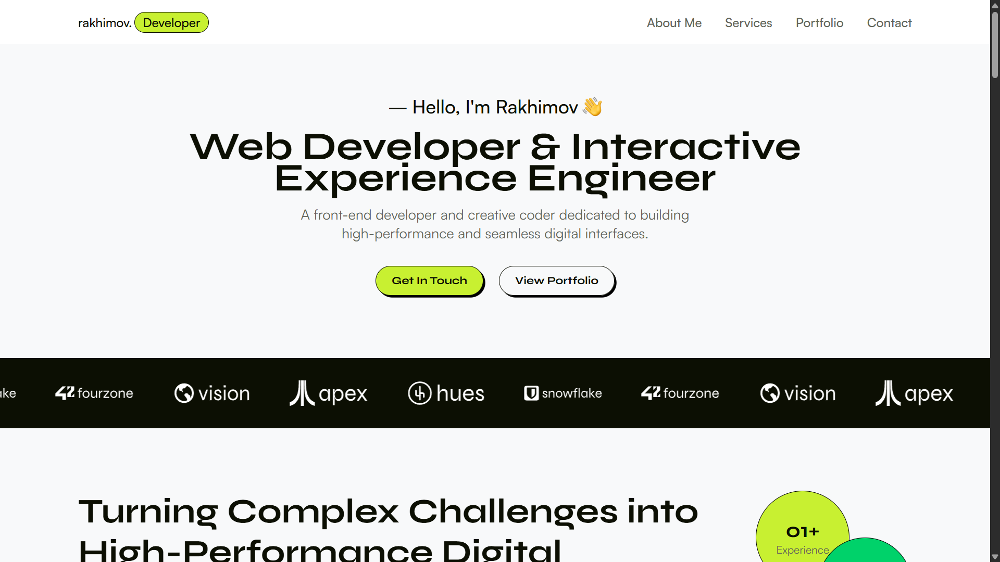

# Portfolio – Web Developer & Interactive Engineer

A minimalist, high-performance professional portfolio and digital craft showcase built with React, Vite, and Tailwind CSS.

## 🚀 Live Preview

> **Note:** Replace the placeholder below with your actual screenshot path and live link.

[](https://rakhim.com)
_Click the image above to view the live site._

---

## ✨ Features

- **Interactive UI/UX** – Fluid interactive experience focusing on high-performance digital realities.
- **Digital Craft Showcase** – Clean grid featuring selected works and case studies.
- **Fully Responsive & Accessible** – Tailored layout for seamless mobile, tablet, and desktop viewing.
- **Modern Form Handling** – Contact section integrated with validation.

---

## 🛠️ Tech Stack

- **Framework:** React 19
- **Build Tool:** Vite (Fast HMR)
- **Styling:** Tailwind CSS
- **Icons & Fonts:** Custom SVGs & Web Fonts

---

## 📦 Getting Started

### 1. Clone the repository

```bash
git clone [https://github.com/rakhimov-web/portfolio-v2.git](https://github.com/rakhimov-web/portfolio-v2.git)
cd portfolio-v2
```
